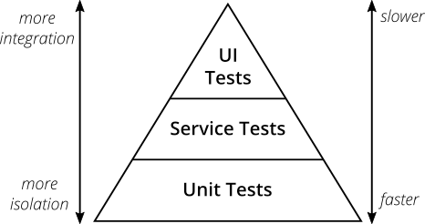

# Testing

---

## Types of Testing
- **Unit Testing**: Testing individual units or components in isolation. 
- **Integration Testing (Service Tests)**: Testing the integration (behavior) of different modules or components of a software. 
- **System Testing (E2E Tests)**: E2E testing starting at users perspective.

### Unit Testing
- Fakes: A fake is a lightweight implementation of an interface that returns hard-coded values. Fakes are used in unit tests to isolate the code under test from the dependencies. Think database in memory collection.
- Stubs: A stub is a fake object that implements an interface but has fixed responses to method calls. Stubs are used in unit tests to isolate the code under test from the dependencies.
- Mocks: A mock is a fake object that implements an interface and has expectations of how it will be used. Mocks are used in unit tests to isolate the code under test from the dependencies.

## Test Method Flow
- **Arrange**: Set up the test data.
- **Act**: Perform the test.
- **Assert**: Verify the test results.

## What to test?
- **Happy Path**: The most common path through the code.
- **Edge Cases**: The extreme cases that are unlikely to happen.
- **Error Handling**: The code should handle errors gracefully.
- **Performance**: The code should perform well under load.

## Testing Do's
- Test methods names should be concise and understand what is being tested without looking at the test code.

### Common Convention
`MethodName_StateUnderTest_ExpectedBehavior`

Example
> AddItemToCard_WithEmptyCart_ShouldAddItemToCart

### Gerkin Style
`Given_When_Then`

Example
> GivenItemAddedToCart_WhenCartIsEmpty_ThenCartContainsOneItem

- Follow AAA Pattern (Arrange, Act, Assert)
- Testing single responsibility principle
    - Focus on testing one specific behavior or condition.
- Make tests repeatable
    - Be careful with Fakers, they can produce different results each time.
- Provide helpful assert messages
- Happy path tests are good, but edge cases are more important. What happens if I passed in this, or that? If your test needs a specific state, what happens if it doesn't have that state or in a different state?
- Write test cases that exercise any boundary conditions
  - Off-by-one errors. E.g., using >= when you meant >
  - Also applies to minimum and maximum allowable values

# Basis testing

---
To figure out roughly how many tests should be written, count paths.

- Counting paths
  - 1 for straight path
  - 1 for each if selection
  - 1 for each looping structure
  - 1 for each “and” and “or”
  - 1 for each case in switch (include default)

- Cyclomatic complexity
  - 0-5 is normal
  - 6-10 look to simplify
  - \> 10 too complex, decompose into other methods

